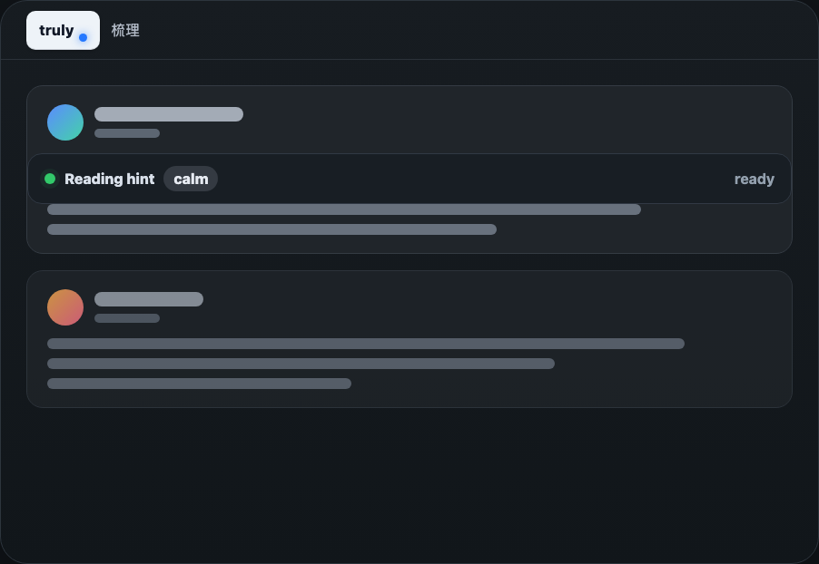
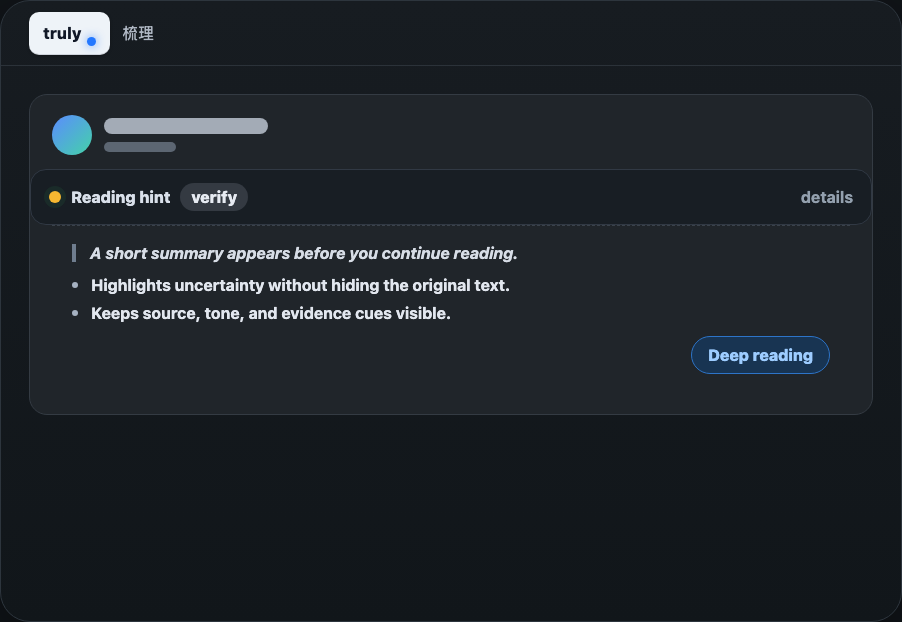
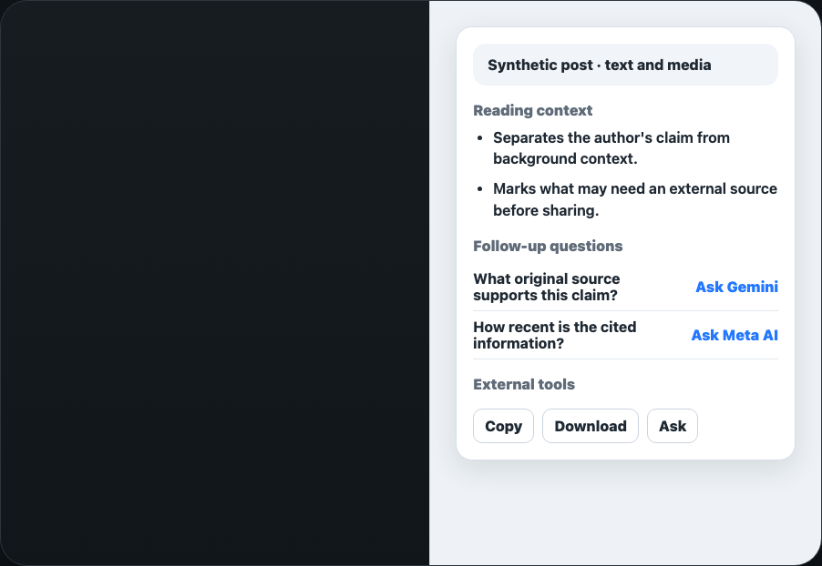

# Truly

梳理

Truly is a local-first Chrome extension for improving reading clarity in social
feeds and web pages.

Truly is an early preview. The current build focuses on Facebook reading
surfaces, while the product direction is broader than any single platform.

## Preview

<p>
  
  
  
</p>

## What It Does

- Shows compact reading hints before supported posts.
- Expands into a short summary and reading signals when you ask for more.
- Opens a side panel for deeper context, follow-up questions, and manual
  external-tool handoff.
- Checks Traditional Chinese language conventions when enabled and applicable.

## Privacy Model

- Truly does not operate a project-owned backend for feed content.
- Reading analysis runs in the model environment you choose.
- External tools receive content only when you explicitly click an external
  action.

See `docs/release/privacy-policy.md` for the release-facing privacy policy.

## Current Preview Scope

- Chrome Manifest V3 extension.
- Browser-local, local endpoint, or private endpoint model sources.
- Current UI support is focused on Facebook reading surfaces.
- Public tests use synthetic fixtures only.

## Recommended Model Setup

Truly works best with Chrome built-in Gemini Nano for zero-configuration early
testing.

For stronger local setups, we currently recommend:

- Ollama + `gemma4:e4b-it-qat` for lightweight local reading hints and summaries.
- A larger OpenAI-compatible local endpoint for deeper reading analysis.

See [Model Setup](docs/model-setup.md) for requirements and examples.

## Roadmap

**Now**

- Public early preview release and feedback collection.
- Bug fixes and stability improvements.

**Next**

- Comment analysis support.
- More social feed surfaces.
- A lightweight universal mode for regular web pages.

**Later**

- Mobile-friendly reading workflows.
- Social collaboration features, such as shared signals for suspicious accounts
  or posts.

## Feedback And Contributions

For general early preview feedback, use the feedback page once it is available:
<https://trulyreader.org/feedback/>

Use GitHub Issues for reproducible bugs, screenshots, logs, or visible technical
problems. Pull requests are welcome for small fixes, docs, and public test
coverage. Please open an issue before large features or platform expansion work.

Security issues should follow `SECURITY.md` rather than public issue details.

## Development

```bash
npm ci
npm run check:public
npm run build
```

For local extension reload shortcuts during development:

```bash
npm run build:dev
```

Create a local Alpha artifact:

```bash
npm run release:alpha
```

`release:alpha` writes ignored artifacts under `artifacts/alpha/`.

## License And Notices

Truly is licensed under Apache-2.0.

Truly bundles zhtw-mcp for Traditional Chinese language-convention checks. See
`THIRD_PARTY_NOTICES.md`.
