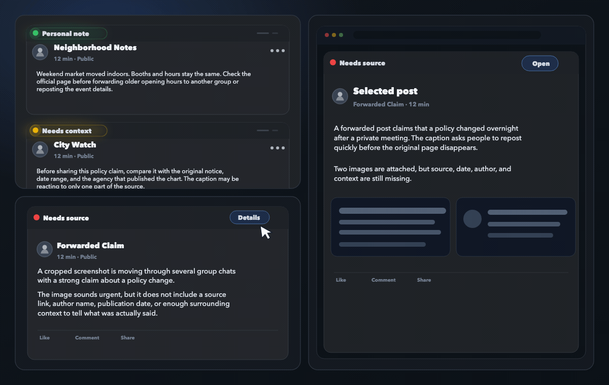

<p>
  
</p>

Truly is a local-first Chrome extension for improving reading clarity in social
feeds and web pages.

Truly · 梳 理: to comb through and clarify.

> **Early Preview:** useful for testing, still changing quickly. The current
> build focuses on selected social feed surfaces on desktop Chrome, while the
> product direction is broader than any single platform.

## Preview

<p>
  
</p>

Synthetic examples: reading hints, expanded view, and side panel. No private
feed content.

## What It Does

- Adds a compact signal before supported posts so you can decide whether to
  read normally, slow down, or verify context first.
- Expands the signal into a short summary and reading cues when you ask for
  more.
- Opens a side panel for deeper context, follow-up questions, and manual
  handoff to external tools.
- Checks Traditional Chinese language conventions with bundled zhtw-mcp when
  enabled and applicable.

## Early Preview Quick Start

Build the extension:

```bash
npm ci
npm run build
```

Then open `chrome://extensions`, enable Developer mode, choose **Load
unpacked**, and select `dist/`.

After installation:

1. Open Options.
2. Start with Chrome built-in Gemini Nano, or configure Ollama /
   OpenAI-compatible endpoints.
3. Open a supported page in desktop Chrome.
4. Use the reading hint, expanded summary, or side panel.
5. Send feedback through <https://trulyreader.org/feedback/>.

Public install links will be added when the first preview release is ready.

## Roadmap

**Now**

- Public early preview release and feedback collection.
- Bug fixes and stability improvements.

**Next**

- Comment analysis support.
- More social feed surfaces.
- A lightweight universal mode for regular web pages.

**Later**

- Mobile-friendly reading workflows.
- Social collaboration features, such as shared signals for suspicious accounts
  or posts.

## Current Scope

- Chrome Manifest V3 extension.
- Browser-local, local endpoint, or private endpoint model sources.
- Current UI support is focused on Facebook reading surfaces.
- Public tests use synthetic fixtures only.

## Model Sources

Truly works best with Chrome built-in Gemini Nano for zero-configuration early
testing. Other model sources are useful when you want stronger local or private
endpoints.

| Source | Best first use | Main caveat |
| --- | --- | --- |
| Chrome built-in Gemini Nano | Zero-configuration preview testing | Availability depends on Chrome-managed model requirements and downloads. |
| Ollama | Local model experiments | Requires local service setup and extension access to the endpoint. |
| OpenAI-compatible endpoint | Stronger private endpoints | Deep reading requires compatible model and response-format support. |

See [Model Setup](docs/model-setup.md) for hardware requirements, endpoint
examples, and recommended models.

## Current Limitations

- Truly is not a fact-checking authority or truth engine.
- Model output can be wrong, incomplete, or biased.
- Site support is still limited.
- Some features depend on Chrome or local model availability.

## Privacy At A Glance

| Question | Answer |
| --- | --- |
| Does Truly run its own backend? | No project-owned backend or telemetry for feed content. |
| When can content leave the browser? | When your selected model source or an external action requires it. |
| What does Truly store? | Chrome extension storage in your browser profile: settings, readiness state, configured model endpoint URLs, and model names. |
| Who receives external-tool content? | Only destinations you explicitly choose, such as search, Meta AI, clipboard, or downloads. |

See `docs/release/privacy-policy.md` for the release-facing privacy policy.

## Feedback And Contributions

For general early preview feedback, use <https://trulyreader.org/feedback/>.

Use GitHub Issues for reproducible bugs, screenshots, logs, or visible technical
problems. Pull requests are welcome for small fixes, docs, and public test
coverage. Please open an issue before large features or platform expansion work.

Security issues should follow `SECURITY.md` rather than public issue details.

## Development

```bash
npm ci
npm run check:public
npm run build
```

For local extension reload shortcuts during development:

```bash
npm run build:dev
```

Create a local Alpha artifact:

```bash
npm run release:alpha
```

`release:alpha` writes ignored artifacts under `artifacts/alpha/`.

## License And Notices

Truly is licensed under Apache-2.0.

Truly bundles zhtw-mcp for Traditional Chinese language-convention checks. See
`THIRD_PARTY_NOTICES.md`.
